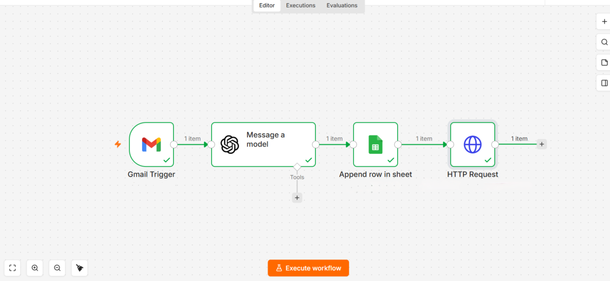
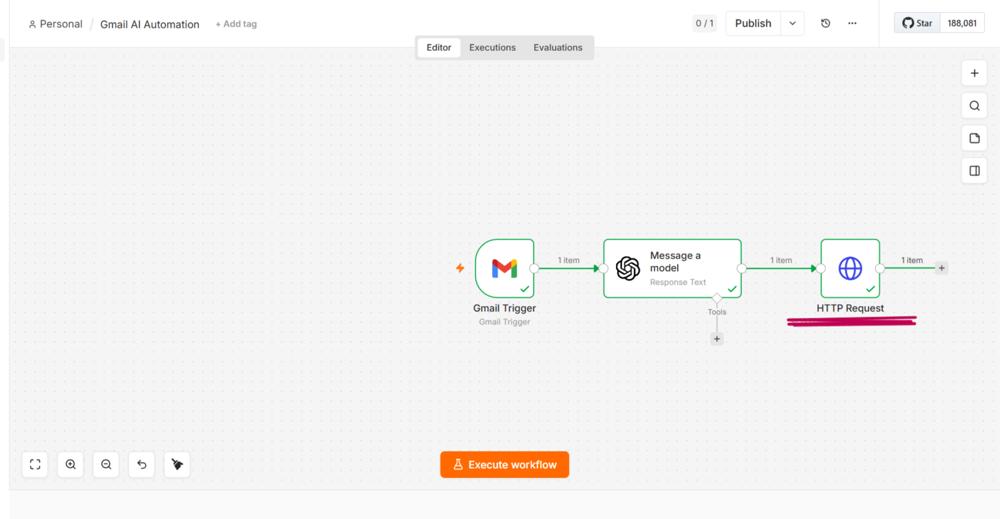
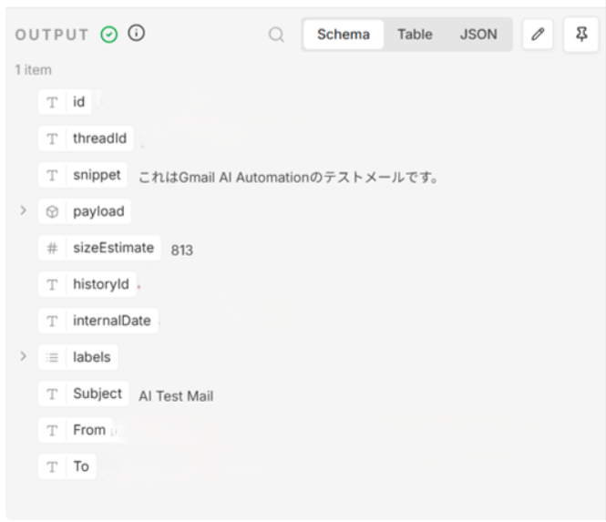
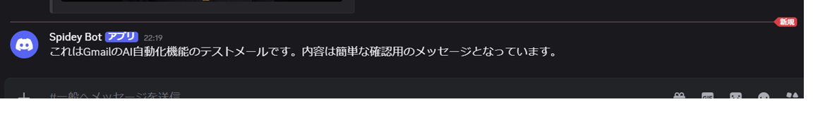

# Gmail AI Automation

## Overview
AI-powered Gmail automation workflow built with n8n, Gmail API, OpenAI API, Google Sheets, and Discord Webhook.

This workflow automatically retrieves new Gmail messages, summarizes them using OpenAI, stores the processed data in Google Sheets, and sends AI-generated notifications to Discord.

## Technologies Used
- n8n
- Gmail API
- OAuth2
- OpenAI API
- Google Sheets API
- Discord Webhook
- JSON

## Workflow Structure

Gmail Trigger  
↓  
OpenAI Email Summary  
↓  
Google Sheets Storage  
↓  
Discord Notification

## Features
- Automatically retrieves new Gmail messages
- Summarizes emails using OpenAI API
- Stores email summary data in Google Sheets
- Sends AI summaries to Discord
- Reduces manual email checking
- Improves team information sharing

## Screenshots

### Full Workflow

### Gmail Trigger Workflow

### Gmail Data Retrieval

### Discord AI Notification

## Use Cases
- Customer inquiry management
- AI-powered email summaries
- Internal team notifications
- Reducing time spent checking emails
- Organizing important information automatically

## Future Improvements
- Automatic priority classification
- AI-generated reply suggestions
- CRM integration
- Slack integration
- Advanced email categorization
- AI priority detection
